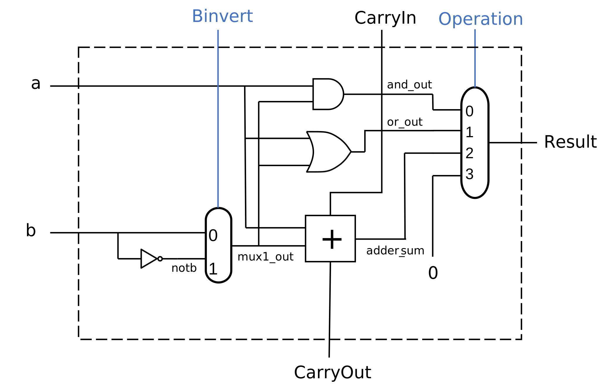

# One-bit ALU

**Deadline:** Fri, 3/1/2024

*If you work on a lab computer, save your files to cloud storage like OneDrive.
Otherwise, you may lose your files.*

Write concise comments in code.

## Learning Objectives

* Implement combinational circuit in MyHDL.

* Implement combinational circuit from logic diagram.

## Prepare

*   Lecture slides on digital circuit design. 

*   Python environment with MyHDL package installed. 

*   Study examples in `gate2.py` and `mux.py` to learn how combinational
    circuit are constructed in MyHDL. The link to the examples is in the next
    section.

### MyHDL

Please install MyHDL and run examples before the lab.

The MyHDL package installation instructions are [on this
page](https://github.com/zhijieshi/cse3666/tree/master/myhdl).

Examples of MyHDL are [in this
directory](https://github.com/zhijieshi/cse3666/tree/master/digital-logic/myhdl).

[The reference manual of MyHDL](http://docs.myhdl.org/en/stable/) explains the
data types for hardware design very well. It also also has many examples.

[This page](https://github.com/zhijieshi/cse3666/blob/master/myhdl/signals.md)
explains Signals and data types we can use to store signals.

## Description

In this lab, we implement a 1-bit ALU in MyHDL. 

The circuit diagram of 1-bit ALU is shown below.  If the link does not work,
the file, `alu1.svg`, is in the same directory as this file.

Study the diagram. Note that all signals in the figure are named. In later
labs, you may have to name signals yourself. Each signal must have a unique
name. Do **NOT** use the same name for different signals.  

Note that the output of the AND gate, the OR gate, and the adder (including
carryout) are always generated by hardware. They do not depend on the
operation signal.

### Skeleton code

The skeleton code is in `alu1.py`. The program does not run until we complete
all submodules/functions.

Study the skeleton code.  Our tasks will be done inside function/module
`ALU1bit`. At the beginning of the function, we create all the signals we see
in the diagram.

Function `comb_not()` shows how a NOT gate is implemented in MyHDL. It
drives `notb`.

**Important:** When we operate on single bits, it is recommended to use Python
logical operators `and`, `or`, and `not`. For multi-bit signals, we use bitwise
logical operators `~`, `&`, `^`, and `|`. Since there is no logical XOR,
we also use `^` on single bits, if it is allowed.

As you can see, we use MyHDL Signals, like `b`, directly in an expression.
Python converts the Signal objects to its underlying datatypes (mainly
integers).

### Steps

Follow the steps to complete the function. Search `TODO` for the locations
where we need to add code. Budget 5 minutes for each step.

1.  Generate `mux1_out` in function `comb_mux_2_1()`. 

    Examples in `mux.py` show several ways to implement a multiplexor.
    We use if-else statement in this lab.

        if binvert:

    Note that the function does not return anything. Do not write a return
    statement in your code (in this function and the functions in later steps).
    The function will be called when the input of the MUX changes and
    `mux1_out` will be updated.

2.  Generate signals `and_out` and `or_out` in functions `comb_and()` and
    `comb_or()`, respectively. 

    The functions are similar to `comb_not`. 

3.  Generate `adder_sum` and `carryout` in `comb_adder()`. 

    **Do not** use `+` in Python. We discussed in lecture how to build a full
    adder with basic gates. We can use Python operators `^`, `not`, `and`, and
    `or` in this step.

4.  Generate `result` in `comb_mux_4_1`. We use if-elif-else statement to
    describe the behavior of the multiplexor.  

    The multiplexor that generates `result` is controlled by `operation`. It
    has two bits. We can compare `operation` directly with integers, as shown
    below. 

        if operation == 0:

### Testing

Note that we cannot run the skeleton code until we finish all steps.  

We can specify the operation(s) to be tested on the command line. For example,
the following command specifies operations 0, 1, and 2, and the expected output
is in `output.txt`. 

    python alu1.py 0 1 2 

We can specify one operation only. For example, the following command sets the
`operation` signal to 0 (for the AND operation). The default operation is 2.

    python alu1.py 0

Pay attention to the `carryout` signals, which is always generated even if the
operation is not addition.

## Deliverables

Submit `alu1.py` in HuskyCT by the deadline. There is no lab5-test.

