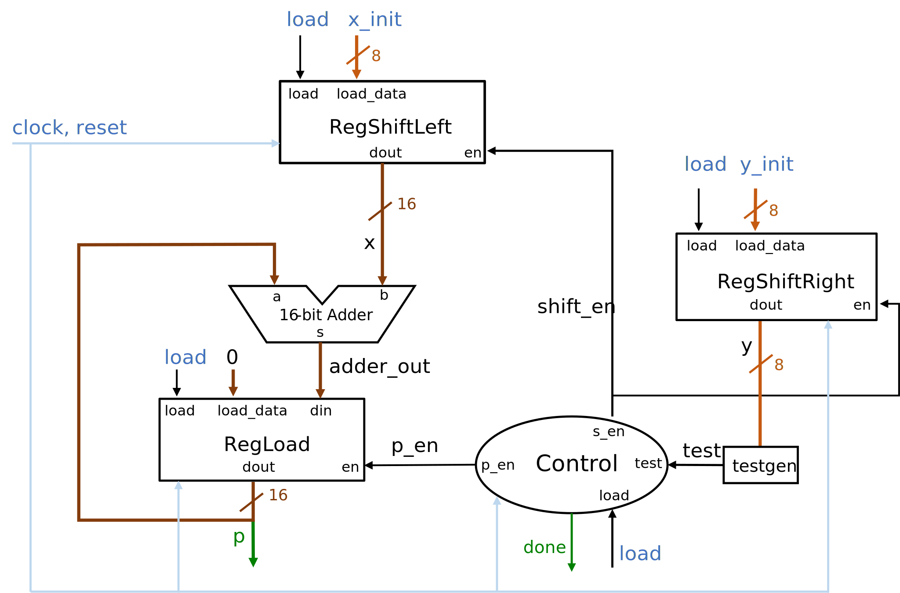

# Multiplier

**Deadline:** Friday, 3/8/2024.

We will keep the lab open until the end of Monday, 3/18, 2024.

*If you work on a lab computer, save your files to cloud storage like OneDrive.
Otherwise, you may lose your files.*

## Learning Objectives

* Implement sequential circuit in MyHDL 

* Build circuit from existing modules

## Description

In this lab, we implement an 8-bit multiplier, following the design we have
discussed in lecture. The lab does not require much coding, but we expect
students read/understand the provided code. 

Here is the diagram of the 8-bit multiplier.



Note that the multiplicand and multiplier are of 8 bits. The multiplicand and
the product are stored in 16-bit registers. The adder adds two 16-bit numbers. 

### Registers

The registers we use in this lab are described below. See the comments in
skeleton code for details.

*   `RegisterLoad` is a register that has an write enable signal, and can also
    load data presented at `load_data`. If `load` is 1, `load_data` is saved in
    the register. If `load` is 0 and `en` is 1, `din` is saved in the register.
    Othewise, the register is not changed.

*   `RegisterShiftLeft` is a shift left register. `load` and `load_data` allow
    us to set a specific value in the register. When `load` is 1, the register
    is set to `load_data`. If `load` is 0 and `en` is 1, the register shifts in
    bits the register to left by 1. The bit shifted into the register is always
    0. If both `load` and `shift_en` are 0, the register is not changed. 

*   `RegisterShiftRight` works similarly to `RegisterShiftLeft`. The difference
    is that this type of registers shifts bits to right.

The implementation of shift registers does not depend on the number of bits in
the input and output signals. The number of bits in signals is specified when a
signal is created. 

### Skeleton code and the operation of the multiplier  

The skeleton code is in `mul.py`.  The implementation of the multiplier is in
block `Mul_ww`.  `ww` indicates the width of the adder is doubled. 

The multiplier has three data ports: `x_init`, `y_init`, and `p`. The
multiplier computes `p = x_init * y_init`. 

The design we have learned needs three registers to hold values for `p`, `x`,
and `y`.  where `p` is the product, `x` is the multiplicand, and `y` is the
multiplier.  

The multiplier also has two ports `load` and `done`, in addition to data,
clock, and reset signals.

When `load` is asserted, the multiplier loads data inputs `x_init` and `y_init`
into registers `x` and `y`, respectively, and 0 into register `p`, at the
positive edge of the clock. When we say register `p`, we mean the register that
stores `p` (or drives signal `p`). Note that `x_init` has only 8 bits while
register `x` has 16 bits. We can consider `x_init` is 0 extended inside the
register, to avoid unnecessary complexity in this lab.

When `load` is deasserted, the multiplier starts to work. When the
multiplication is completed (all bits in `y` have been checked), `done` is
asserted. After that, register `p` has the final product and is no longer
updated. Since `p` is an output signal, other modules can get the product when
`done` is asserted.

### Tasks 

The signals needed in the implementation are already created in the skeleton
code. 

The control module has been implemented. `done` is generated in the module.
Read the comments in the program for its interface. 

The tasks to be completed in this lab are as follows. 

*   Instantiate registers for `p`, `x`, and `y`. Let us call the instances
    `u_reg_p`, `u_reg_x`, and `u_reg_y`, for `p`, `x`, and `y`, respectively.

    Most work to instantiate a module is to identify the signals that are
    connected to the instance. Study the diagram and find the corresponding
    signal in the program. 

    Instantiating a module is similar to creating an object from a class in
    Python. There are examples in the skeleton code, and also in MyHDL examples
    in the repo for suplementary materials.

*   Instantiate the adder. 

*   Generate the `test` signal in function `testgen()`. 

    Check the algorithm in slides to find out which bit should be used as the
    `test` signal.

    The underlying datatype of `x`, `y`, and `p` are `intbv` (or `modbv`).  We
    can access individual bits or a subset of bits. See explanations and
    examples on [this
    page](https://github.com/zhijieshi/cse3666/blob/master/myhdl/signals.md).
  
### Running the program

The program `mul.py` accepts a few arguments from the command line. 

* `-h`: display the help message.

* `<list of numbers>`: specify a list of numbers. The multiplier will multiply
  adjacent numbers. The default is `255 255`.

   ```
   # 255 * 255
   py mul.py

   # 36 * 66
   py mul.py 36 66

   # 100 * 200, then 200 * 255
   py mul.py 100 200 255

   # more numbers can be specified
   ```

* `--trace`: generate a trace file, which can be viewed by waveform viewer like GTKWave.

Sample output of the program is in `output.txt`.  

## Deliverables

Submit `mul.py` and take 'lab6-test' in HuskyCT by the deadline. 

## Extra

*   We can save signal traces with `--trace` option and examine the signal
    waves with [GTKWave](https://github.com/gtkwave/gtkwave).

*   The current implementation of the control module sets `s_en` is set to 0
    when the multiplication is done. The bits in `x` and `y` are not shifted.
    One could keep the `s_en` signal to 1 all the time. 

