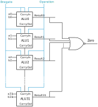

# Five-bit ALU

**Deadline:** Friday, 3/22/2024. 

*If you work on a lab computer, save your files to cloud storage like OneDrive.
Otherwise, you may lose your files.*

## Learning Objectives

*   Implement combinational circuit from logic diagram.

*   Implement combinational circuit in MyHDL, using existing modules.

*   Use more features in MyHDL in design, for example, multi-bits signals and
    shadow signals.

    [This
    page](https://github.com/zhijieshi/cse3666/blob/master/myhdl/signals.md)
    has brief explanations of signals and shadow signals.

## Description

In this lab, we implement a 5-bit ALU, using the 1-bit ALU we built in the
previous lab. A easy way for Python to find the 1-bit ALU module is to copy
`alu1.py` to the working directory for this lab. Students who have not finished
the privous lab can download `alu1.py` provided in this lab. Note that the
provided 1-bit ALU does not meet all requirements in the privous lab.

We have discussed the interface of ALU in lecture, which is also shown in the
following figure. The ALU performs the operation specified by `alu_operation`
on two inputs `a` and `b` and generates `Result`. Output signal `zero` is 1 if
and only if all bits in `Result` are 0.

The internal circuit diagram of the 5-bit ALU is similar to a 32-bit ALU. See
`alu32.svg` directly if the figure does not shown below. Note that `bnegate`
and `operation` signals in the following diagram are bits from `alu_operation`.

### Steps

The skeleton code is in `alu5.py`.  The implementation is in block `ALU5bits`.
**Read the code and comments provided in the skeleton code.**

The steps we take to complete the design are as follows. Budget 10 minutes for
each step.
 
*   Step 1. Create signals to be connected to the carryout and result ports of
    the 1-bit ALUs. 

    In this lab, we store signals in separate variables, e.g., `c1`, `c2`, and
    so on. 

*   Step 2. Instantiate 1-bit ALUs. Connect correct signals to the input and
    output ports of 1-bit ALUs. 

    The skeleton code already instantiates the first 1-bit ALU, ALU0. Follow
    the example and instantiate other three 1-bit ALUs.  Another example of
    instantiating a block is in function `test_comb()`, which instantiates an
    ALU5bits. 

*   Step 3. Generat output signals `result` and `zero` of the 5-bit ALU from
    the output signals of 1-bit ALUs. The logic should be in `comb_output()`
    function. See the comments in the skeleton code.

### Running the program 

The program `alu5.py` accepts a few arguments from the command line. 

*   A list of operation code. The default is 0, 1, 2, and 6.

*   `-a <number>`: specify the value at input `a`. The default value is 26.

    We cannot specify input `b` from the command line. The program sends all
    5-bit patterns to input `b` of the ALU. 

*   `-h`: display the help message.

Here are some examples of running `alu5.py`.

    # use default setting. op = [0, 1, 2, 6].
    python alu5.py

    # test addition only. op = [2]. 
    python alu5.py 2 

    # test subtraction with a set to 15. op = [6]. a = 15.
    python alu5.py 6 -a 15 

The output of the program without any arguments is in `output.txt`. Test your
program with different input.

## Deliverables

Submit `alu5.py` in HuskyCT by the deadline. 

Take Lab5-test in HuskyCT. Study the Overflow section before taking the test.

## Overflow

When performing addition/subtraction, we may not be able to represent the
result with the same number of bits, which is 5 in this lab. This is called
overflow. When overflow happends, the result from ALU is not correct. When
needed, software needs detect overflow and adjust the result.

The detection of overflow depends on how we interpret bits, signed or unsigned.
Study the output of the 5-bit ALU and identify the rows where you see overflow,
assuming 1) bits are signed and then 2) bits are unsigned.

Here is an example. The last line in `output.txt` is:

    0110          11010  11111 | 11011   0

The ALU performed subtraction. 

If all bits are signed, we have -6 - (-1) = -5. The result is correct.

If all bits are unsigned, we have 26 - 31 = 27. The result is not correct. 
